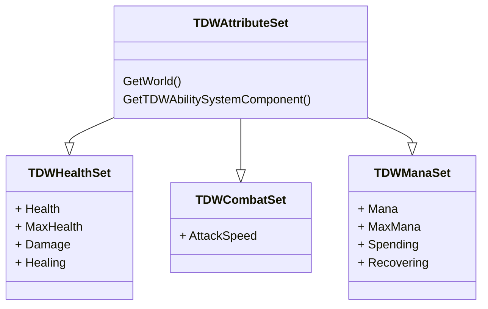

[README](../README.md)

# Architecture
This section describes the [Lyra Sample Game](https://dev.epicgames.com/documentation/en-us/unreal-engine/lyra-sample-game-in-unreal-engine?application_version=5.0) inspired architecture for this project.

## Ability System

**TDWAbilitySystemComponent**
- AbilitySystemComponent derived class
- Handles activating abilities through gameplay tags

**TDWAbilitySet**
- DataAsset derived class
- Handles listing GameplayAbilities, GameplayEffects and AttributeSets to be bound/unbound to a actor with a AbilitySystemComponent

### Abilities

**TDWGameplayAbility**
- GameplayAbility derived class
- Abstract base class for all project gameplay abilities
- Defines how abilities are triggered (InputTrigger, InputHeld, or OnSpawn)

**UTDWGameplayAbility_Emanation**
- TDWGameplayAbility derived class
- Passive ability
- Holds logic to detect actors in a radius, except for the avatar actor that is the center of the emanation.
- Applies a list of *GameplayEffects* to characters in a radius centered around the avatar actor of the ability

### Attributes

**TDWAttributeSet**
- AttributeSet derived class
- Abstract base class for all project attribute sets
- Defines the `ATTRIBUTE_ACCESSORS` macro

**TDWHealthSet**
- Attribute set for handling health/armor/shields as well as healing and damage
- Defines Health and MaxHealth protected attributes with public accessors
- Defines Damage and Healing meta-attributes

**TDWCombatSet**
- Attribute set for combat attributes such as attack speed, etc
- Defines AttackSpeed protected attribute with public accessors

**TDWManaSet**
- Attribute set for handling mana as well as spending and recovering it
- Defines Mana and MaxMana protected attributes with public accessors
- Defines Spending and Recovering meta-attributes

___

## Character

**TDWCharacter**
- Character derived class
- Currently the default player class for the player
- Gets its AbilitySystemComponent from PlayerState on posession/PlayerState replication

**TDWNonPlayerCharacter**
- Character derived class
- Currently the default NPC class for the scene dummies
- Has is own AbilitySystemComponent

### Abilities

**TDWGameplayAbility_Leap**
- TDWGameplayAbility derived class
- Handles leaping to a target location:
    - Determined by the mouse for player triggered ability
- (Optional) Triggers a child ability on landing

**TDWGameplayAbility_Slam**
- TDWGameplayAbility_Emanation derived class
- Handles causing knock back in a radius to all actors inside the emanation

### Components

**TDWCombatComponent**
- ActorComponent derived class
- Handles interface between actors and the TDWCombatSet

**TDWHealthComponent**
- ActorComponent derived class
- Handles interface between actors and the TDWHealthSet

**TDWManaComponent**
- ActorComponent derived class
- Handles interface between actors and the TDWManaSet
- Currently excusive to the player character blueprint

## Input

**TDWInputConfig**
- DataAsset derived class
- *TDWInputAction* struct. Defines relationship between InputAction and GameplayTag
- Container for NativeInputActions and AbilityInputActions

**TDWInputComponent**
- EnhancedInputComponent derived class
- Handles binding native and ability actions to functions based on 

## Player

**TDWPlayerController**
- PlayerController derived class
- Handles player character control and triggering abilities for them

**TDWPlayerState**
- PlayerState derived class
- Container for the player's TDWAbilitySystemComponent (AbilitySystemComponent), TDWHealthSet (HealthSet), TDWCombatSet (CombatSet) and TDWManaSet (ManaSet) attribute sets