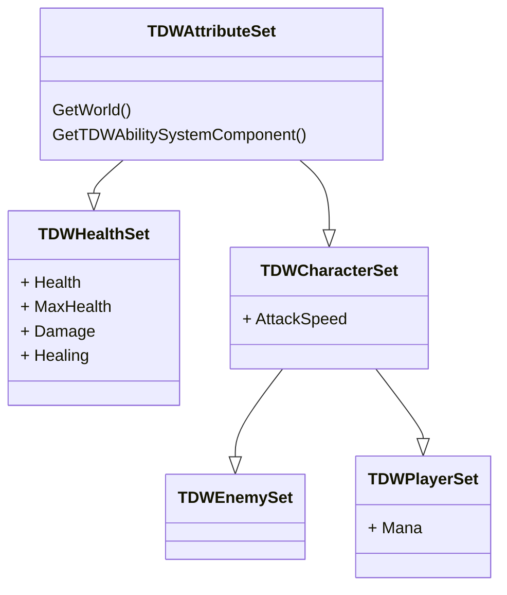

# Gameplay Test - TDW
This is The Dark West technical interview project repository made in Unreal Engine 5.5 and based on the Top-Down template, as described in the evaluation's requirements.

## Goal
Implement the [Leap Slam](https://www.poewiki.net/wiki/Leap_Slam) ability, from Path of Exile, using the Gameplay Ability System. 

In addition the project must result in a scalable and extendable prototype. As well as have documentation in the form of source code comments and descriptions of the development process in this README file.

## Architecture

### Ability System

#### Attributes

**TDWAttributeSet:** 
- Abstract base class for all project attribute sets. 
- Defines the `ATTRIBUTE_ACCESSORS` macro

TDWHealthSet

