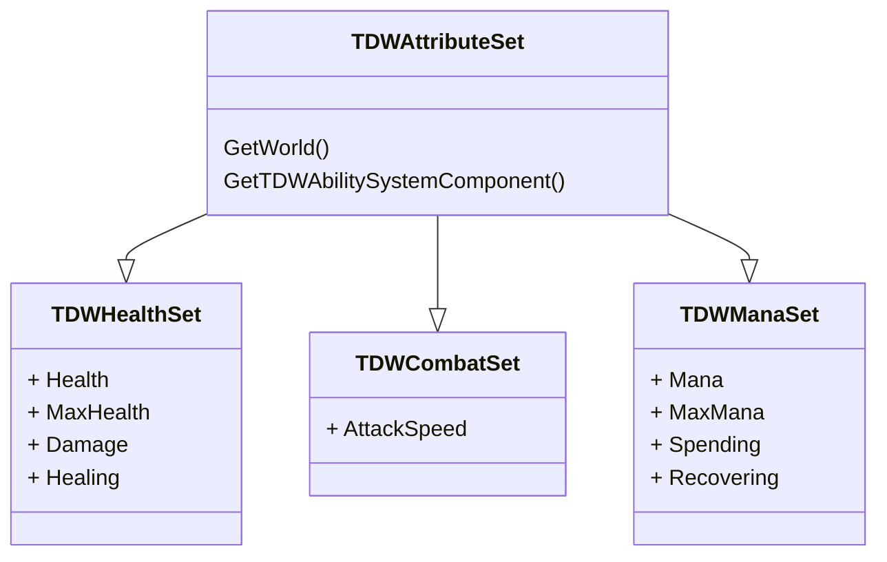

# Gameplay Test - TDW
This is The Dark West technical interview project repository made in Unreal Engine 5.5 and based on the Top-Down template, as described in the evaluation's requirements.

## Goal
Implement the [Leap Slam](https://www.poewiki.net/wiki/Leap_Slam) ability, from Path of Exile, using the Gameplay Ability System. 

In addition the project must result in a scalable and extendable prototype. As well as have documentation in the form of source code comments and descriptions of the development process in this README file.

## Architecture
This section describes the [Lyra Sample Game](https://dev.epicgames.com/documentation/en-us/unreal-engine/lyra-sample-game-in-unreal-engine?application_version=5.0) inspired architecture for this project.

### Ability System

**TDWAbilitySystemComponent**
- Ability system component derived class for the project

#### Attributes

**TDWAttributeSet** 
- Abstract base class for all project attribute sets
- Defines the `ATTRIBUTE_ACCESSORS` macro

**TDWHealthSet**
- Attribute set for handling health/armor/shields as well as healing and damage
- Defines Health and MaxHealth protected attributes with public accessors
- Defines Damage and Healing meta-attributes

**TDWCombatSet**
- Attribute set for combat attributes such as attack speed, etc
- Defines AttackSpeed protected attribute with public accessors

**TDWManaSet**
- Attribute set for handling mana as well as spending and recovering it
- Defines Mana and MaxMana protected attributes with public accessors
- Defines Spending and Recovering meta-attributes

___

### Character

### Input

### Player

**TDWPlayerState**
- PlayerState derived class
- Container for the player's **TDWAbilitySystemComponent** (AbilitySystemComponent), **TDWHealthSet** (HealthSet) and **TDWPlayerSet** (CharacterSet) attribute sets

